# Project Tracker - API Flowcharts

## Overview

This document provides visual flowcharts for key API operations in the Project Tracker system, showing the complete request-response flow including authentication, authorization, and data processing.

---

## 1. User Authentication Flow

### Sign Up Flow

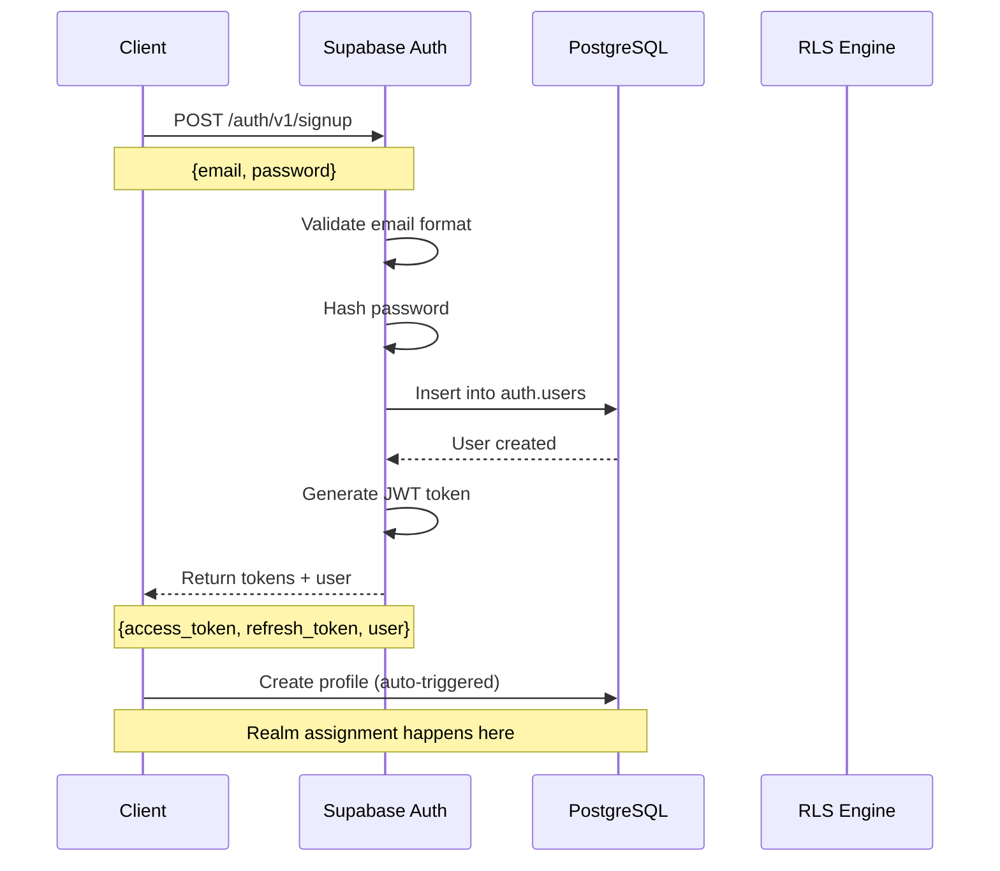

---

### Sign In Flow

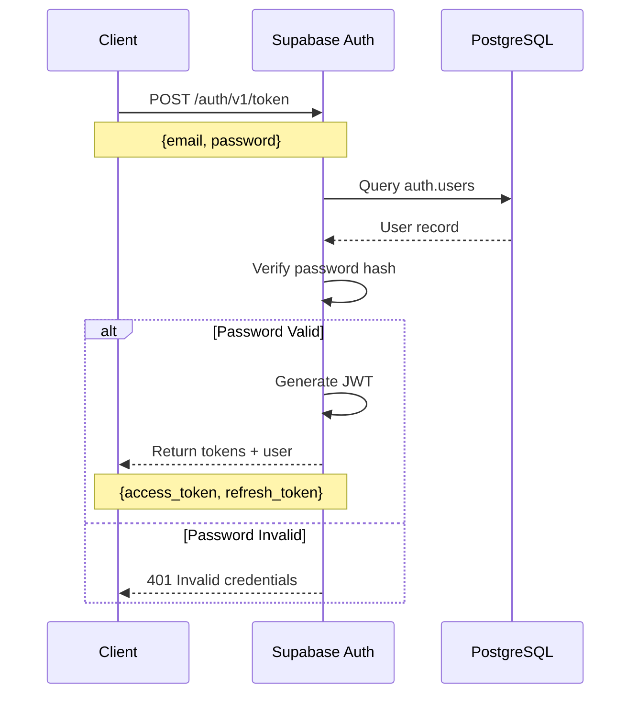

---

## 2. Task Creation Flow

### Create Task with Realm Isolation

```mermaid
sequenceDiagram
    participant Client
    participant PostgREST API
    participant RLS Engine
    participant get_user_realm_id()
    participant Trigger
    participant PostgreSQL
    participant Realtime Server

    Client->>PostgREST API: POST /rest/v1/tasks
    Note over Client,PostgREST API: Authorization: Bearer {JWT}<br/>{name, category, priority}

    PostgREST API->>RLS Engine: Verify JWT
    RLS Engine->>RLS Engine: Extract auth.uid()

    RLS Engine->>get_user_realm_id(): Get user's realm_id
    get_user_realm_id()->>PostgreSQL: SELECT realm_id FROM profiles
    PostgreSQL-->>get_user_realm_id(): realm_id
    get_user_realm_id()-->>RLS Engine: realm_id

    alt Realm Found
        RLS Engine->>Trigger: BEFORE INSERT trigger
        Trigger->>Trigger: Auto-populate:<br/>realm_id, user_id, created_by
        Trigger->>PostgreSQL: INSERT INTO tasks
        PostgreSQL-->>Trigger: Row inserted

        Trigger->>PostgreSQL: Log to action_history
        PostgreSQL-->>Trigger: Log created

        PostgreSQL->>Realtime Server: Notify change (WebSocket)
        Realtime Server->>Client: Broadcast INSERT event

        PostgreSQL-->>PostgREST API: Return new task
        PostgREST API-->>Client: 201 Created + task data
    else No Realm Found
        RLS Engine-->>Client: 403 Forbidden<br/>User not in any realm
    end
```

---

## 3. Data Retrieval Flow (with RLS)

### List Tasks with Realm Filtering

```mermaid
sequenceDiagram
    participant Client
    participant PostgREST API
    participant RLS Engine
    participant get_user_realm_id()
    participant PostgreSQL

    Client->>PostgREST API: GET /rest/v1/tasks
    Note over Client,PostgREST API: Authorization: Bearer {JWT}

    PostgREST API->>RLS Engine: Verify JWT
    RLS Engine->>RLS Engine: Extract auth.uid()

    RLS Engine->>get_user_realm_id(): Get user's realm_id
    get_user_realm_id()->>PostgreSQL: SELECT realm_id FROM profiles<br/>WHERE id = auth.uid()
    PostgreSQL-->>get_user_realm_id(): realm_id
    get_user_realm_id()-->>RLS Engine: realm_id

    RLS Engine->>PostgreSQL: SELECT * FROM tasks<br/>WHERE realm_id = {user_realm_id}
    Note over RLS Engine,PostgreSQL: RLS automatically filters by realm

    PostgreSQL-->>RLS Engine: Filtered results
    RLS Engine-->>PostgREST API: Tasks in user's realm only
    PostgREST API-->>Client: 200 OK + tasks array
```

---

## 4. Nested Query Flow

### Get Tasks with Full Hierarchy

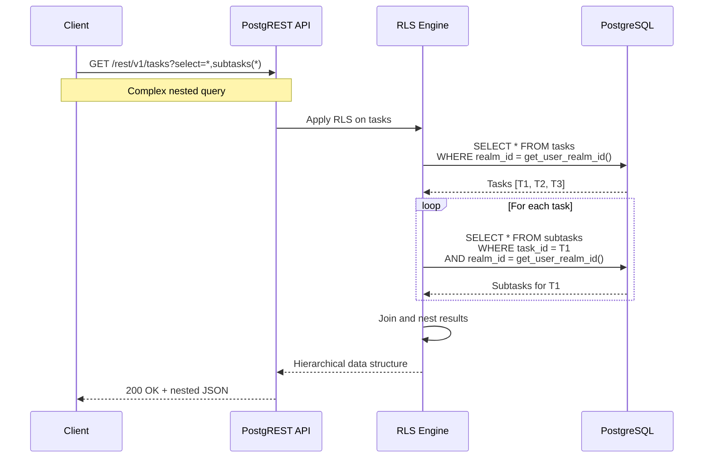

---

## 5. Update Operation Flow

### Update Task with Validation

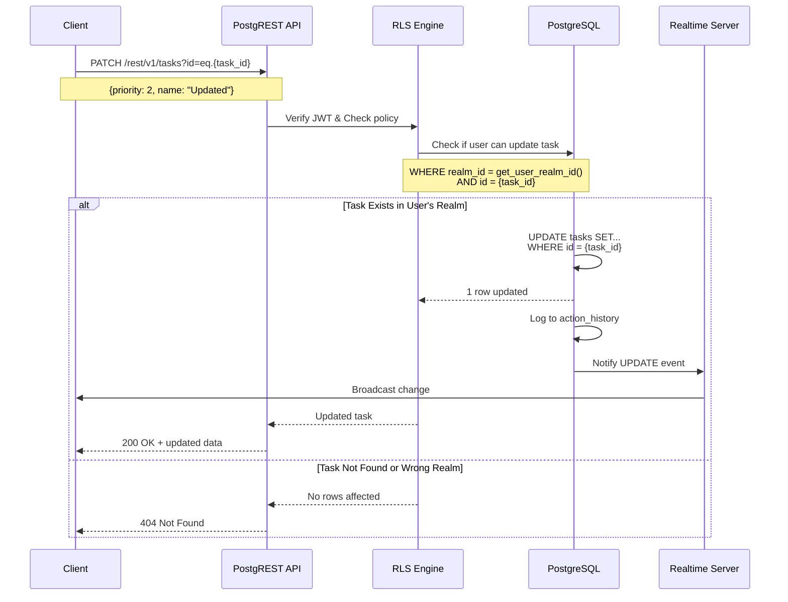

---

## 6. Delete Operation with Cascade

### Delete Task (Cascade to Subtasks)

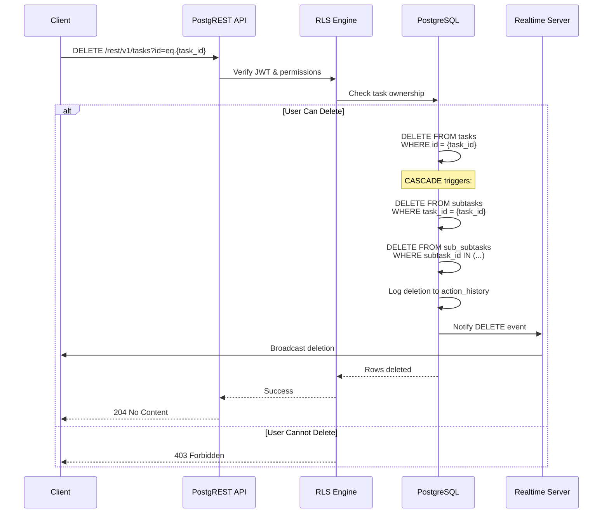

---

## 7. Real-time Subscription Flow

### WebSocket Real-time Updates

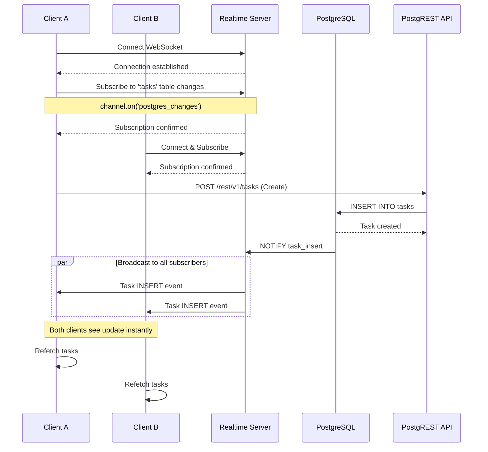

---

## 8. Milestone Creation Flow

### Create Milestone with Constraints

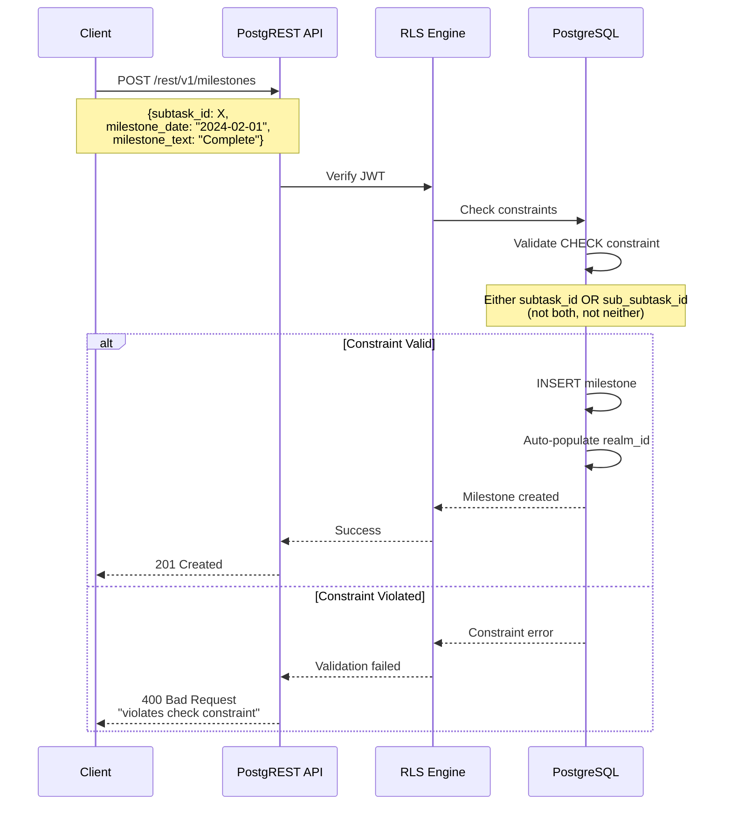

---

## 9. Configuration Update Flow

### Upsert Configuration

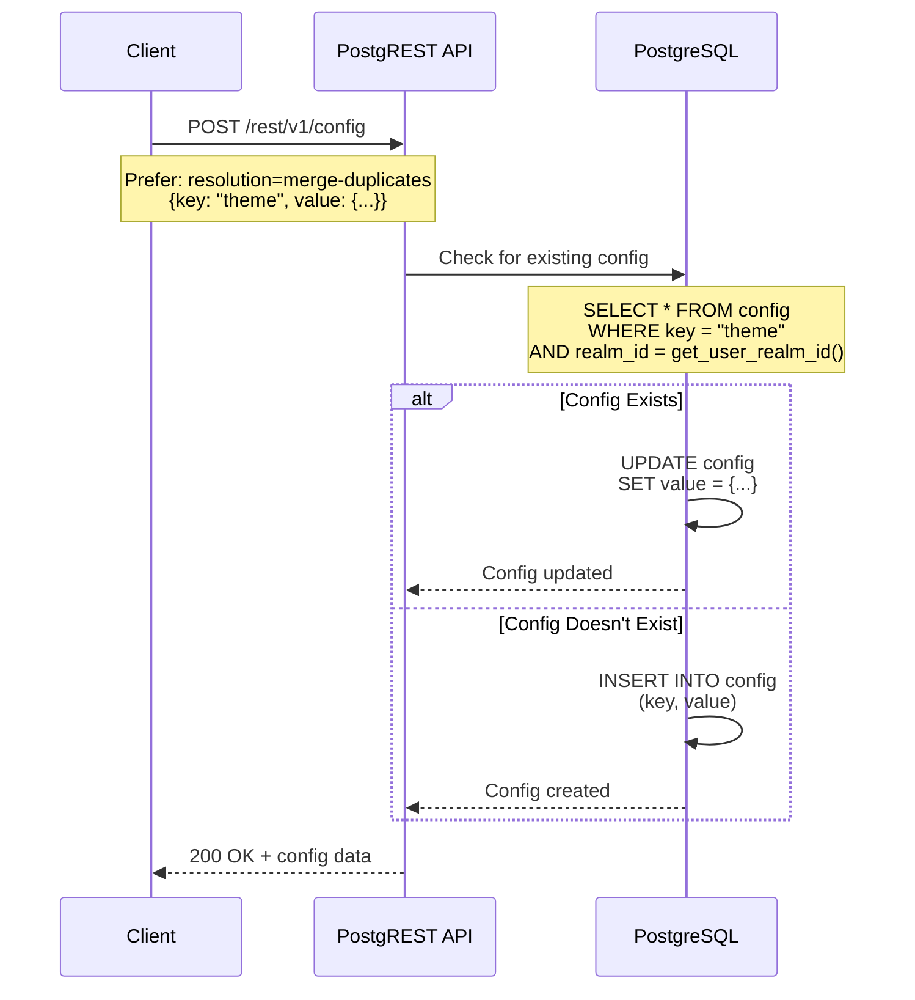

---

## 10. Action History Logging Flow

### Automatic Audit Trail

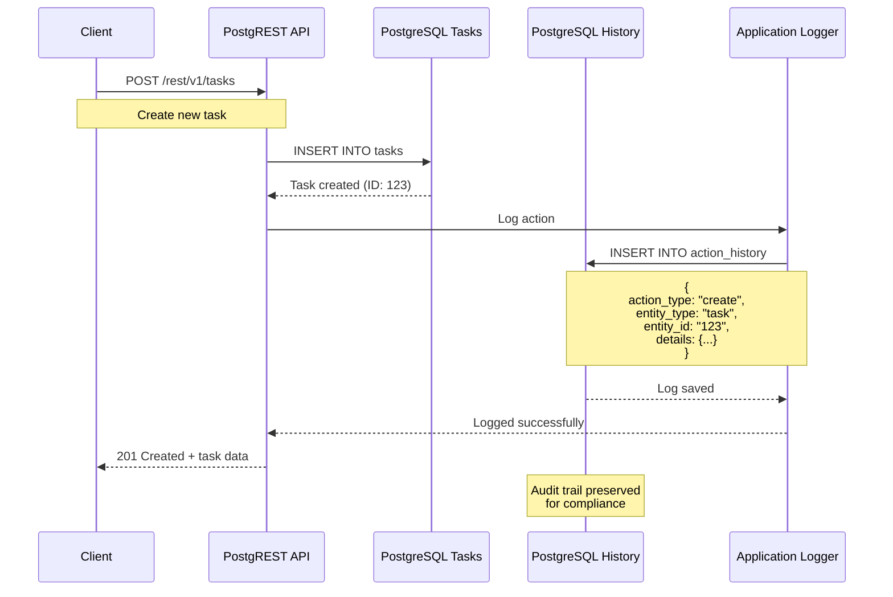

---

## 11. Multi-Tenant Isolation Enforcement

### Realm Boundary Protection

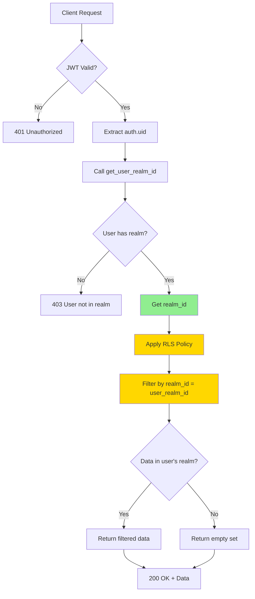

---

## 12. Error Handling Flow

### Common Error Scenarios

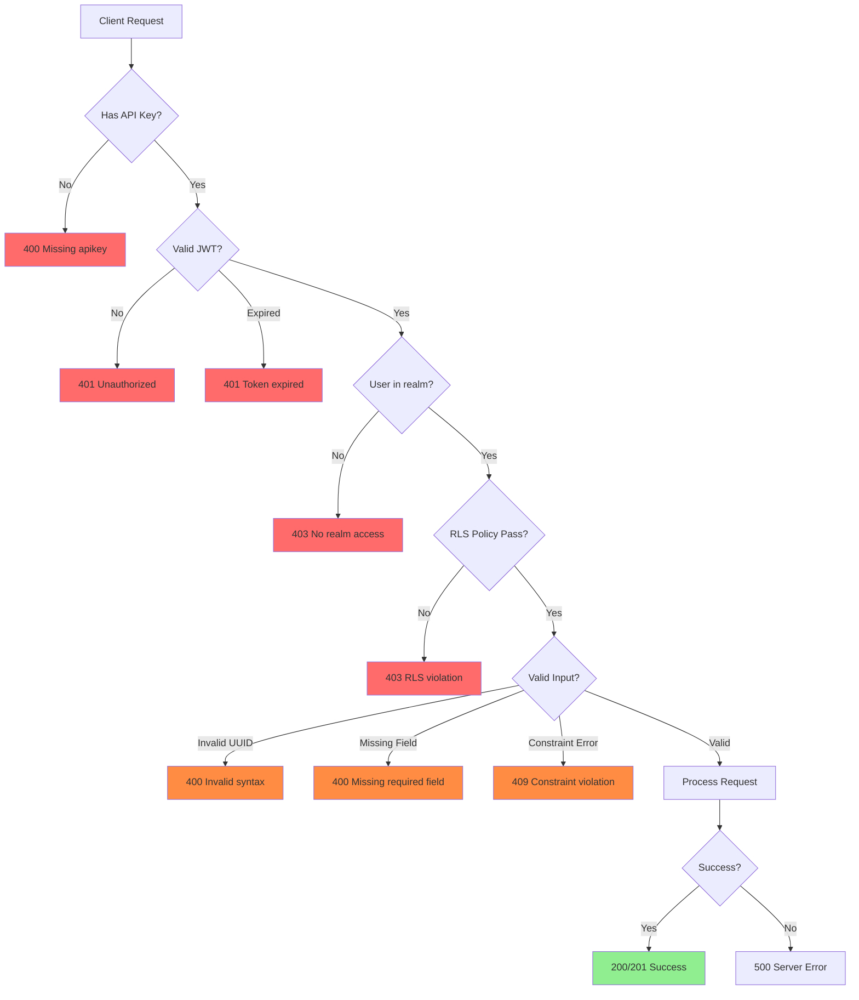

---

## 13. Full Task Hierarchy Query

### Complex Nested Data Retrieval

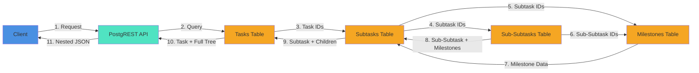

---

## 14. Batch Operations Flow

### Multiple Subtasks Creation

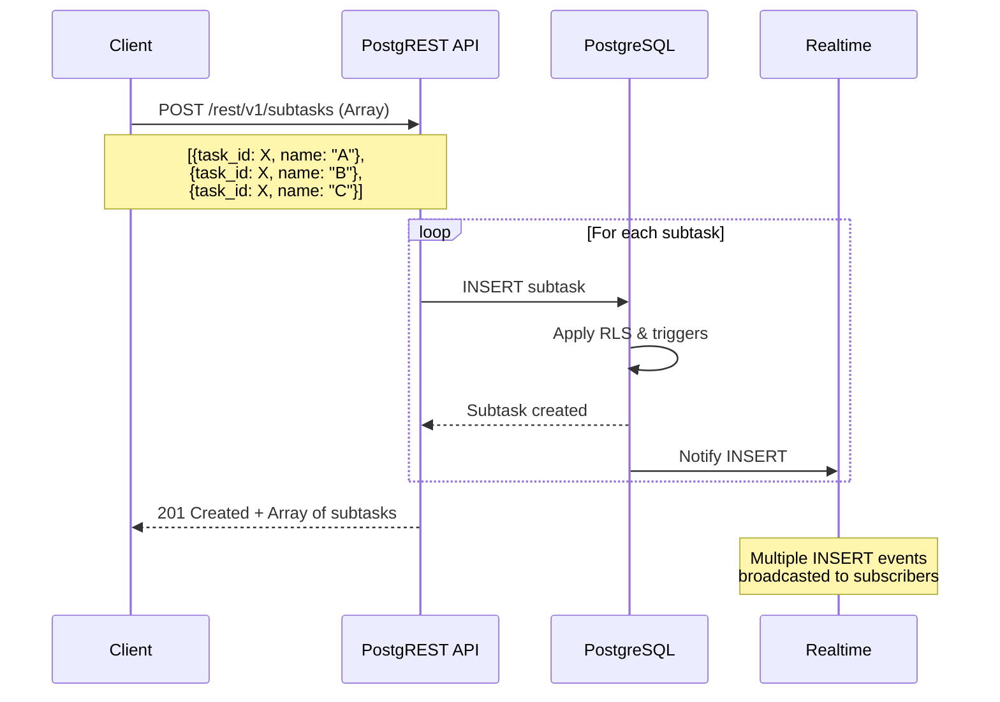

---

## 15. Access Control Decision Flow

### RBAC Policy Evaluation

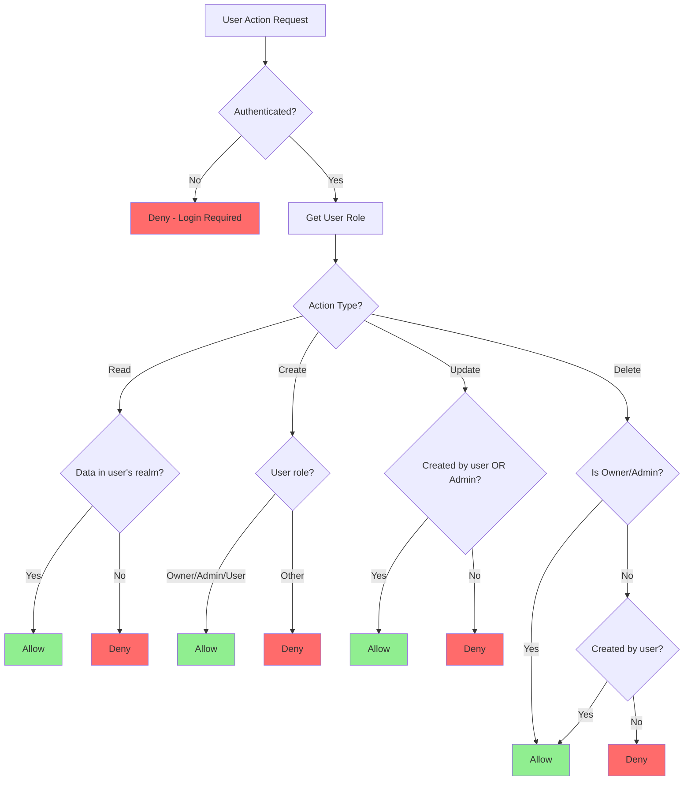

---

## Summary

These flowcharts illustrate:

1. **Authentication**: JWT-based auth with token management
2. **Authorization**: Multi-tenant realm isolation via RLS
3. **Data Operations**: CRUD with automatic realm filtering
4. **Real-time**: WebSocket subscriptions for live updates
5. **Error Handling**: Comprehensive error scenarios
6. **Complex Queries**: Nested data retrieval patterns
7. **Audit Logging**: Automatic action history tracking
8. **Access Control**: Role-based permission evaluation

All operations maintain strict realm isolation, ensuring complete data security in a multi-tenant environment.
