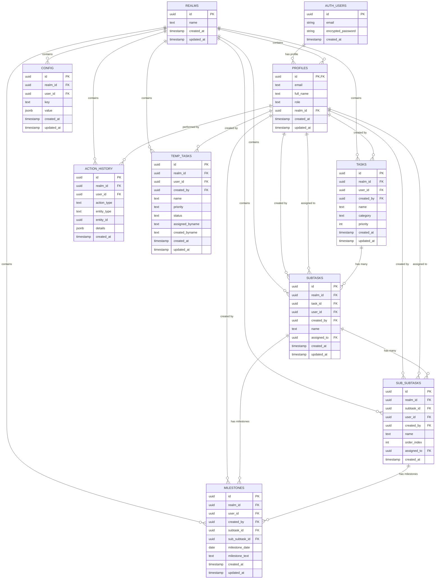

# Project Tracker - Entity Relationship Diagram

## Database Schema Overview

This document describes the complete database schema including tables, relationships, and constraints.

---

## ER Diagram (Mermaid)



---

## Table Descriptions

### Core Tables

#### 1. **auth.users** (Supabase Managed)
Built-in Supabase authentication table.

| Column | Type | Constraints | Description |
|--------|------|-------------|-------------|
| id | uuid | PRIMARY KEY | Unique user identifier |
| email | text | UNIQUE, NOT NULL | User email address |
| encrypted_password | text | | Encrypted password hash |
| created_at | timestamptz | DEFAULT now() | Account creation timestamp |

---

#### 2. **realms**
Organizations or workspaces that contain users and data.

| Column | Type | Constraints | Description |
|--------|------|-------------|-------------|
| id | uuid | PRIMARY KEY | Unique realm identifier |
| name | text | NOT NULL | Realm name |
| created_at | timestamptz | DEFAULT now() | Creation timestamp |
| updated_at | timestamptz | DEFAULT now() | Last update timestamp |

**Relationships:**
- One-to-Many with `profiles`
- One-to-Many with all project tables

**RLS Policies:**
- Users can view their own realm
- Users can insert realms
- Admins can update their realm

---

#### 3. **profiles**
Extended user information linked to auth.users.

| Column | Type | Constraints | Description |
|--------|------|-------------|-------------|
| id | uuid | PRIMARY KEY, FK → auth.users(id) | User ID (same as auth.users) |
| email | text | NOT NULL | User email |
| full_name | text | | User's full name |
| role | text | DEFAULT 'user' | User role in realm |
| realm_id | uuid | FK → realms(id) ON DELETE CASCADE | Associated realm |
| created_at | timestamptz | DEFAULT now() | Profile creation time |
| updated_at | timestamptz | DEFAULT now() | Last update time |

**Roles:**
- `owner`: Full control
- `realm_admin`: Admin privileges
- `admin`: Management privileges
- `user`: Standard access

**Relationships:**
- One-to-One with `auth.users`
- Many-to-One with `realms`
- One-to-Many with `tasks`, `subtasks`, `sub_subtasks`

**RLS Policies:**
- Users can view profiles in their realm
- Users can insert their own profile
- Users can update their own profile

---

### Project Management Tables

#### 4. **tasks**
Top-level work items.

| Column | Type | Constraints | Description |
|--------|------|-------------|-------------|
| id | uuid | PRIMARY KEY | Unique task identifier |
| realm_id | uuid | FK → realms(id) ON DELETE CASCADE | Owning realm |
| user_id | uuid | FK → profiles(id) | Associated user |
| created_by | uuid | FK → profiles(id) | Creator |
| name | text | NOT NULL | Task name |
| category | text | NOT NULL, CHECK | Category (dev/test/infra/support) |
| priority | int | DEFAULT 2, CHECK (1-3) | Priority level |
| created_at | timestamptz | DEFAULT now() | Creation time |
| updated_at | timestamptz | DEFAULT now() | Last update |

**Categories:**
- `dev`: Development tasks
- `test`: Testing tasks
- `infra`: Infrastructure tasks
- `support`: Support tasks

**Priority Levels:**
- 1: High
- 2: Medium (default)
- 3: Low

**Relationships:**
- Many-to-One with `realms`
- One-to-Many with `subtasks`

**RLS Policies:**
- Realm-based isolation (all CRUD operations)

**Triggers:**
- `trg_tasks_realm`: Auto-populate realm_id and user_id

---

#### 5. **subtasks**
Second-level breakdown of tasks.

| Column | Type | Constraints | Description |
|--------|------|-------------|-------------|
| id | uuid | PRIMARY KEY | Unique subtask identifier |
| realm_id | uuid | FK → realms(id) ON DELETE CASCADE | Owning realm |
| task_id | uuid | FK → tasks(id) ON DELETE CASCADE | Parent task |
| user_id | uuid | FK → profiles(id) | Associated user |
| created_by | uuid | FK → profiles(id) | Creator |
| name | text | NOT NULL | Subtask name |
| assigned_to | uuid | FK → profiles(id) | Assigned engineer |
| created_at | timestamptz | DEFAULT now() | Creation time |
| updated_at | timestamptz | DEFAULT now() | Last update |

**Relationships:**
- Many-to-One with `tasks`
- Many-to-One with `realms`
- One-to-Many with `sub_subtasks`
- One-to-Many with `milestones`

**RLS Policies:**
- Realm-based isolation (all CRUD operations)

**Triggers:**
- `trg_subtasks_realm`: Auto-populate realm_id and user_id

---

#### 6. **sub_subtasks**
Third-level granular work items.

| Column | Type | Constraints | Description |
|--------|------|-------------|-------------|
| id | uuid | PRIMARY KEY | Unique identifier |
| realm_id | uuid | FK → realms(id) ON DELETE CASCADE | Owning realm |
| subtask_id | uuid | FK → subtasks(id) ON DELETE CASCADE | Parent subtask |
| user_id | uuid | FK → profiles(id) | Associated user |
| created_by | uuid | FK → profiles(id) | Creator |
| name | text | NOT NULL | Sub-subtask name |
| order_index | int | DEFAULT 0 | Display order |
| assigned_to | uuid | FK → profiles(id) | Assigned engineer |
| created_at | timestamptz | DEFAULT now() | Creation time |

**Relationships:**
- Many-to-One with `subtasks`
- Many-to-One with `realms`
- One-to-Many with `milestones`

**RLS Policies:**
- Realm-based isolation (all CRUD operations)

**Triggers:**
- `trg_sub_subtasks_realm`: Auto-populate realm_id and user_id

---

#### 7. **milestones**
Date-based goals and deliverables.

| Column | Type | Constraints | Description |
|--------|------|-------------|-------------|
| id | uuid | PRIMARY KEY | Unique identifier |
| realm_id | uuid | FK → realms(id) | Owning realm |
| user_id | uuid | FK → profiles(id) | Associated user |
| created_by | uuid | FK → profiles(id) | Creator |
| subtask_id | uuid | FK → subtasks(id) | Associated subtask (optional) |
| sub_subtask_id | uuid | FK → sub_subtasks(id) | Associated sub-subtask (optional) |
| milestone_date | date | NOT NULL | Target date |
| milestone_text | text | NOT NULL | Milestone description |
| created_at | timestamptz | DEFAULT now() | Creation time |
| updated_at | timestamptz | DEFAULT now() | Last update |

**Constraints:**
- CHECK: Milestone must belong to either subtask OR sub_subtask (not both, not neither)

**Relationships:**
- Many-to-One with `subtasks` (optional)
- Many-to-One with `sub_subtasks` (optional)
- Many-to-One with `realms`

**RLS Policies:**
- Realm-based isolation (all CRUD operations)

**Triggers:**
- `trg_milestones_realm`: Auto-populate realm_id and user_id

---

### Configuration & Audit Tables

#### 8. **config**
Realm-wide configuration settings.

| Column | Type | Constraints | Description |
|--------|------|-------------|-------------|
| id | uuid | PRIMARY KEY | Unique identifier |
| realm_id | uuid | FK → realms(id) ON DELETE CASCADE | Owning realm |
| user_id | uuid | FK → profiles(id) | Associated user |
| key | text | NOT NULL | Config key |
| value | jsonb | DEFAULT '{}' | Config value (JSON) |
| created_at | timestamptz | DEFAULT now() | Creation time |
| updated_at | timestamptz | DEFAULT now() | Last update |

**Constraints:**
- UNIQUE(realm_id, key): One config per key per realm

**Common Config Keys:**
- `theme`: UI theme settings
- `category_colors`: Task category color mappings
- `category_opacity`: Color transparency settings

**RLS Policies:**
- Realm-based isolation (all CRUD operations)

---

#### 9. **action_history**
Audit log of all user actions.

| Column | Type | Constraints | Description |
|--------|------|-------------|-------------|
| id | uuid | PRIMARY KEY | Unique identifier |
| realm_id | uuid | FK → realms(id) ON DELETE CASCADE | Owning realm |
| user_id | uuid | FK → profiles(id) | User who performed action |
| action_type | text | NOT NULL | Type of action |
| entity_type | text | NOT NULL | Entity affected |
| entity_id | uuid | | ID of affected entity |
| details | jsonb | DEFAULT '{}' | Action details (JSON) |
| created_at | timestamptz | DEFAULT now() | Action timestamp |

**Action Types:**
- `create`: Entity creation
- `update`: Entity modification
- `delete`: Entity deletion

**Entity Types:**
- `task`, `subtask`, `sub_subtask`, `milestone`, `config`

**RLS Policies:**
- Users can view history in their realm
- Users can insert history records

---

#### 10. **temp_tasks**
Temporary task storage before formal assignment.

| Column | Type | Constraints | Description |
|--------|------|-------------|-------------|
| id | uuid | PRIMARY KEY | Unique identifier |
| realm_id | uuid | FK → realms(id) ON DELETE CASCADE | Owning realm |
| user_id | uuid | FK → profiles(id) | Associated user |
| created_by | uuid | FK → profiles(id) | Creator |
| name | text | NOT NULL | Task name |
| priority | text | | Priority description |
| status | text | DEFAULT 'draft' | Task status |
| assigned_byname | text | | Name of assigner |
| created_byname | text | | Name of creator |
| created_at | timestamptz | DEFAULT now() | Creation time |
| updated_at | timestamptz | DEFAULT now() | Last update |

**Statuses:**
- `draft`: Initial state
- `pending`: Awaiting approval
- `approved`: Ready for conversion
- `rejected`: Not accepted

**RLS Policies:**
- Realm-based isolation
- Users can only insert their own temp_tasks

---

## Database Functions

### 1. **get_user_realm_id()**
Returns the realm_id for the currently authenticated user.

```sql
CREATE OR REPLACE FUNCTION get_user_realm_id()
RETURNS uuid AS $$
BEGIN
  RETURN (
    SELECT realm_id
    FROM profiles
    WHERE id = auth.uid()
    LIMIT 1
  );
END;
$$ LANGUAGE plpgsql SECURITY DEFINER STABLE;
```

**Usage:** Used in all RLS policies to filter data by realm.

---

### 2. **auto_populate_realm_and_user()**
Trigger function to automatically populate realm_id, user_id, and created_by on INSERT.

```sql
CREATE OR REPLACE FUNCTION auto_populate_realm_and_user()
RETURNS TRIGGER AS $$
DECLARE
  current_realm uuid;
BEGIN
  current_realm := get_user_realm_id();

  IF current_realm IS NULL THEN
    RAISE EXCEPTION 'User does not belong to any realm';
  END IF;

  NEW.realm_id := current_realm;
  NEW.user_id := auth.uid();
  NEW.created_by := auth.uid();

  RETURN NEW;
END;
$$ LANGUAGE plpgsql SECURITY DEFINER;
```

**Applied To:**
- tasks
- subtasks
- sub_subtasks
- milestones

---

## Indexes

Recommended indexes for optimal query performance:

```sql
-- Tasks
CREATE INDEX idx_tasks_realm_id ON tasks(realm_id);
CREATE INDEX idx_tasks_category ON tasks(category);
CREATE INDEX idx_tasks_created_at ON tasks(created_at);

-- Subtasks
CREATE INDEX idx_subtasks_task_id ON subtasks(task_id);
CREATE INDEX idx_subtasks_realm_id ON subtasks(realm_id);
CREATE INDEX idx_subtasks_assigned_to ON subtasks(assigned_to);

-- Sub-subtasks
CREATE INDEX idx_sub_subtasks_subtask_id ON sub_subtasks(subtask_id);
CREATE INDEX idx_sub_subtasks_realm_id ON sub_subtasks(realm_id);
CREATE INDEX idx_sub_subtasks_assigned_to ON sub_subtasks(assigned_to);

-- Milestones
CREATE INDEX idx_milestones_subtask_id ON milestones(subtask_id);
CREATE INDEX idx_milestones_sub_subtask_id ON milestones(sub_subtask_id);
CREATE INDEX idx_milestones_date ON milestones(milestone_date);

-- Action History
CREATE INDEX idx_action_history_created_at ON action_history(created_at DESC);
CREATE INDEX idx_action_history_user_id ON action_history(user_id);
```

---

## Cascade Delete Behavior

### When a Realm is Deleted:
- All profiles in realm are deleted
- All tasks, subtasks, sub-subtasks are deleted
- All milestones are deleted
- All config entries are deleted
- All action history is deleted

### When a Task is Deleted:
- All subtasks are deleted (CASCADE)
- All sub-subtasks are deleted (CASCADE via subtasks)
- All related milestones remain (unless explicitly deleted)

### When a Subtask is Deleted:
- All sub-subtasks are deleted (CASCADE)
- All subtask milestones remain orphaned (need manual cleanup)

### When a User (Profile) is Deleted:
- Associated auth.users record is deleted (CASCADE)
- Tasks/subtasks created_by and assigned_to become NULL
- Action history records remain for audit trail

---

## Data Integrity Rules

1. **Realm Isolation**: All data must belong to exactly one realm
2. **User Realm Consistency**: Users can only create/modify data in their realm
3. **Hierarchical Integrity**: Tasks → Subtasks → Sub-subtasks must maintain parent-child relationships
4. **Milestone Exclusivity**: Milestones belong to either subtask OR sub-subtask, never both
5. **Category Validation**: Tasks must have valid category (dev/test/infra/support)
6. **Priority Range**: Task priority must be between 1 and 3
